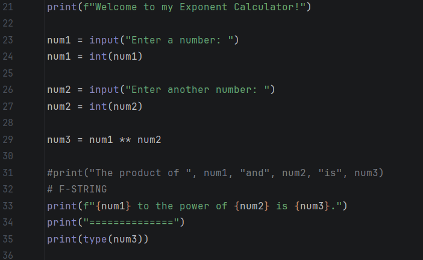
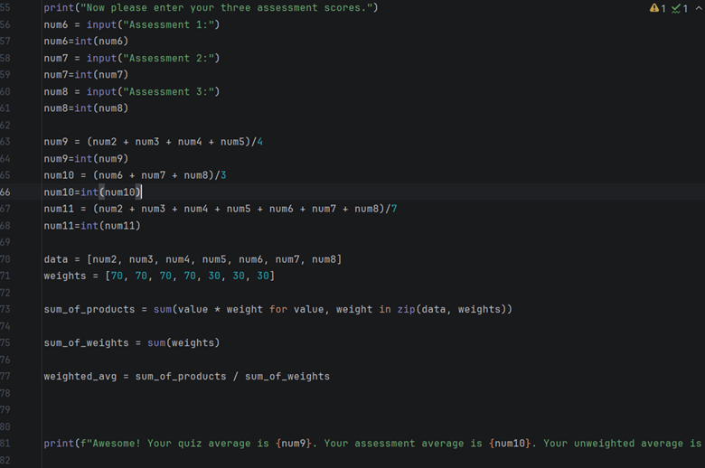
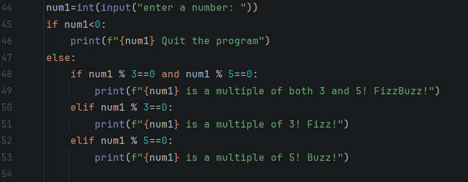

# CS105/6/7/8 Portfolio
# Alex Deuber
## Portfolio
Contact Info: andeuber@loyola.edu
### About Me 
Hello! I am a college student at Loyola University of Maryland, and I have been practicing my coding skills all semester.
With skills in problem-solving, Python coding, debugging, and logical thinking, I have been able to develop functional programs and achieve accurate and efficient results. I have become adept at using Python, GitHub, and Excel.
My strong skill set, commitment to learning, and passion for technology and programming makes me a valuable asset. In my spare time, I love to workout and to learn new skills.
You can find me on [Instagram.](https://www.instagram.com/alexdeuber/)
### Education 
I graduated from Calvert Hall College High School in 2025 and I am now a freshman at Loyola University of Maryland.

***
### Projects

 Project 1: Exponent Calculator
 - My first [project](https://github.com/LoyolaUnivMD/sp26-cs105-python-week-1-andeuber123) is an exponent calculator. It is used to calculate powers of numbers. This is useful because doing exponent math manually can be slow and error-prone.
 - 
 - This project was fully done on Python. I primarily used basic input/output functions and the exponent symbol for python (**). My main struggle with this project was converting input strings into integers. I solved this problem by using int() to ensure proper calculations. I used class notes and examples from the lectures to guide my code structure. Ultimately, I successfully created a working calculator that computes exponents. I would improve it by allowing decimal inputs and error handling.
***
#### Project 2: Grade Calculator
 - My second [project](https://github.com/LoyolaUnivMD/sp26-cs105-python-week-2-andeuber123) is a grade calculator. It is used to calculate quiz and assessment averages. This is useful because manually calculating weighted grades can be time-consuming.
 - 
 - This project was fully completed in Python. I used lists and loops, along with basic arithmetic operations. The hardest part about this project was managing all of the different variables and calculating the weighted averages. I solved them by organizing my data into lists and loops. the class lectures were a major help throughout this project. Ultimately, I successfully created a program that can be used to calculate quiz averages, assessment averages, weighted averages, and overall grades. I would improve this project by adding user input validation or letter grades.
***
#### Project 3: FizzBuzz Calculator
 - My third [project](https://github.com/LoyolaUnivMD/sp26-cs105-python-week-3-andeuber123) is a FizzBuzz calculator. It is a fun little chunk of code that identifies multiples of 3 and 5. This is useful because it helps practice conditional logic.
 - 
 - This project was fully completed on Python. It consists of if and elseif statements and the % operation. I had problems structuring the conditions correctly, but I solved it by checking the combined condition first. The class example was a big help with this project. The results were that I successfully created a working FizzBuzz program. I would improve it by allowing it to run through a range of numbers instead of just one input.

